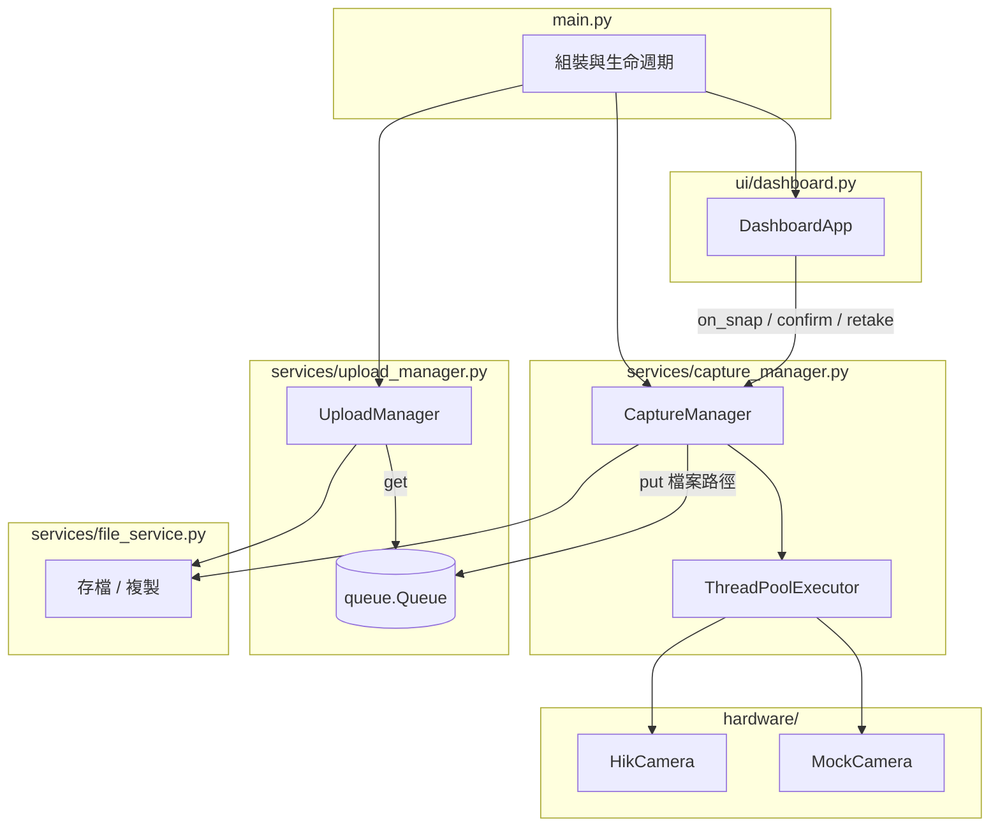
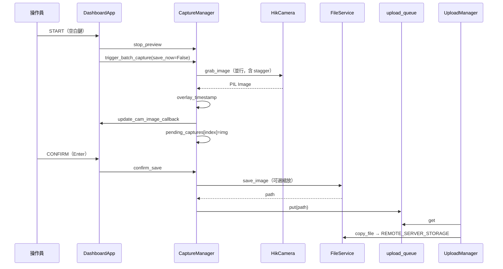

# 自動拍照系統（AutoPhote）專案架構及程式碼分析 v2

> 本文件依目前程式庫實際內容整理，作為 v1（`專案架構及程式碼分析.md`）的擴充與修正版。重點補強：**執行緒與佇列模型**、**檔案與資料夾規則（與 v1 不同處已更正）**、**海康 MVS 整合細節**、**UI 與設定的實際行為**。

---

## 1. 專案定位與目標

AutoPhote 是面向現場作業的 **多路工業相機拍照工作站**：以 Tkinter 儀表板操作，支援 **即時預覽**、**批次軟體觸發拍照**、**畫面上確認後再存檔**，並將檔案 **背景複製到共用儲存路徑**（程式內稱為 upload，實作為 `shutil.copy` 至 `REMOTE_SERVER_STORAGE`）。

**與典型「按了就存」的差異**：`START` 僅抓取並暫存於記憶體（`pending_captures`），需 `CONFIRM` 才寫入磁碟並進入上傳佇列；`RETAKE` 可捨棄暫存並恢復預覽。

---

## 2. 技術棧與執行環境

| 項目 | 說明 |
|------|------|
| 語言 | Python 3（建置腳本以 3.10 venv 為例） |
| UI | `tkinter` + `ttk` |
| 影像 | Pillow（PIL）、NumPy（僅 Mock 相機合成圖） |
| 工業相機 | 海康機器人 MVS Python SDK（`MvCameraControl_class`），經 `ctypes` 載入 Win64 Runtime |
| 組態 | 專案目錄或 exe 同層的 `settings.json`（見 `config.py`） |
| 日誌 | `utils/logger.py` → 檔案 `system.log` + 標準輸出 |
| 打包 | `build_onefile.bat` → PyInstaller 單檔 `AutoPhote.exe` |

**`requirements.txt` 備註**：列有 `numpy`、`Pillow`、`fake-useragent`、`requests`、`tk`。目前應用程式核心路徑 **未使用** `requests` / `fake-useragent`（可視為預留或歷史依賴）；`tk` 在 Windows 上通常內建於 Python，實務上以官方安裝為準。

---

## 3. 目錄結構（應用程式本體）

與執行直接相關的目錄如下（`Python/` 為 MVS 官方範例與 `MvImport`，非本專案業務邏輯必要條件，但開發環境常與 SDK 路徑並存）。

```text
AutoPhone_0504/   （專案根目錄）
├── main.py                 # 進入點：組裝 UI、Capture、Upload、關機清理
├── config.py               # settings.json 載入/儲存、模組級設定變數
├── settings.json           # 執行時設定（若不存在則用預設值）
├── requirements.txt
├── build_onefile.bat       # venv + PyInstaller 一鍵建置
├── hardware/
│   ├── hik_camera.py       # 海康 GigE：連線、取像、預覽執行緒
│   └── mock_camera.py      # 無硬體時的 CameraBase 實作
├── services/
│   ├── capture_manager.py  # 多相機並行拍照、命名、佇列餵檔
│   ├── upload_manager.py   # 背景執行緒：自佇列取路徑並複製到遠端目錄
│   └── file_service.py     # 目錄建立、JPEG/PNG 存檔、copy/move
├── ui/
│   └── dashboard.py        # 監控分頁、設定分頁、快捷鍵、全螢幕
└── utils/
    ├── image_utils.py      # 時間戳疊字
    └── logger.py
```

---

## 4. 邏輯架構（分層）



- **表現層**：`DashboardApp` 只透過回呼與 `CaptureManager` 互動，不直接碰 SDK。
- **協調層**：`main.py` 建立共享的 `upload_queue`，並注入 UI 更新回呼，避免循環依賴。
- **領域層**：`CaptureManager` 統一「預覽 / 拍照 / 暫存 / 確認存檔 / 流水號 / 子資料夾」。
- **基礎設施層**：`FileService`、`HikCamera`、日誌。

---

## 5. 程式啟動與關閉流程（`main.py`）

1. **路徑**：將專案根目錄加入 `sys.path`，確保 `import config` 等相對套件可用。
2. **Pillow 全域**：取消大圖像素上限、允許截斷載入，避免高解析度工業影像觸發 DecompressionBomb。
3. **目錄**：`FileService.ensure_directory` 建立 `LOCAL_TEMP_BUFFER` 與 `REMOTE_SERVER_STORAGE`（後者若磁碟不存在會在 `config.get_valid_path` 時落到專案下 `Server_Storage`）。
4. **佇列**：`queue.Queue()` 作為 Capture → Upload 的管線。
5. **Tk 根視窗**：先建立 `tk.Tk()`，再建立 `CaptureManager` / `UploadManager`，最後才 `DashboardApp(...)`。
6. **相機**：`capture_mgr.initialize_cameras()` 依 `config.CAMERA_COUNT` 填滿固定長度列表 `cameras[i]`，失敗則該槽為 `None`，**索引與 UI CAM 編號對齊**。
7. **預覽**：`start_preview()` 僅對 `HikCamera` 實例呼叫 `start_streaming`；Mock 無串流實作。
8. **上傳**：`upload_mgr.start()` 啟動 daemon 執行緒。
9. **關閉**：`WM_DELETE_WINDOW` → `capture_mgr.shutdown()`（停預覽、斷線、`executor.shutdown`）→ `upload_mgr.stop()` → `destroy`。

**按鈕語意（與 `main.py` 對應）**

- `START`：`set_sn` + `trigger_batch_capture(save_now=False)` → 影像進 `pending_captures`，不落檔。
- `CONFIRM`：`set_sn` + `confirm_save()` → 寫檔並 `upload_queue.put(path)`。
- `RETAKE`：`discard_capture()` → 清空暫存並將狀態回到已連線的 READY。

---

## 6. 設定系統（`config.py`）

### 6.1 載入與持久化

- `APP_BASE_DIR`：原始碼模式為專案目錄；`PyInstaller` 凍結模式為 `sys.executable` 所在目錄，確保 `settings.json` 與 exe 放一起時可寫入。
- `load_settings()`：以 `DEFAULT_SETTINGS` 為底，讀取 JSON 後 `update` 合併。
- `reload_settings()`：執行期重新讀檔並呼叫 `_apply_loaded_settings()`，更新模組上的 `JPEG_QUALITY`、`CAMERA_COUNT`、路徑、`CAPTURE_STAGGER_MS`、`GRAB_FRAME_TIMEOUT_MS` 等。

### 6.2 與 UI 設定頁的關係（`dashboard.save_settings_ui`）

儲存成功後會 `reload_settings()`，提示使用者：**觸發錯開、取幀逾時、JPEG、縮放、路徑等可立即生效**；**相機數量、IP、監控版面重排** 仍需重啟程式以重新 `initialize_cameras()` 與建立網格。

### 6.3 硬體開關

- `USE_REAL_CAMERA`：`True` 時使用 `HikCamera`，`False` 時使用 `MockCamera`（開發/測試）。

---

## 7. 拍照與預覽核心（`CaptureManager`）

### 7.1 資料結構

- `cameras`：`list`，長度 `CAMERA_COUNT`，元素為相機實例或 `None`。
- `pending_captures`：`dict`，key 為 0-based 相機索引，value 為 PIL `Image`。
- `ThreadPoolExecutor(max_workers=CAMERA_COUNT)`：每輪拍照一個 task 對應一台相機（略過 `None`）。

### 7.2 觸發錯開（GigE 友善）

`_capture_task` 內：若 `CAPTURE_STAGGER_MS > 0` 且 `index > 0`，則 sleep `(index * stagger_ms) / 1000`，讓多相機在同一區網時 **錯開軟體觸發**，減少交換器突發與逾時（註解說明與現場調參 30–80ms 等）。

### 7.3 單張工作管線

1. `camera.grab_image()` 取得 PIL 影像。
2. `overlay_timestamp(img, camera_id=index+1)` 疊上時間與 CAM 編號（失敗則略過疊字，保留原圖）。
3. `update_cam_image_callback` → UI 以主執行緒 `after` 更新（見下一節）。
4. 若 `save_now=False`：存入 `pending_captures`，狀態碼 **5（CHECK/Review）**。
5. 若 `save_now=True`：直接 `_save_and_queue`（本專案預設流程以 `False` + `confirm_save` 為主）。

### 7.4 存檔與命名

- **可選縮放**：`RESIZE_RATIO < 100` 時以 `Image.Resampling.BILINEAR` 縮放（註解：多相機高畫素批次時比 LANCZOS 省時）。
- **資料夾**：
  - 第一層：`LOCAL_TEMP_BUFFER` 下 **民國年+月日** 目錄 `roc_folder`（例如西元 2026-05-04 → `1150504`）。
  - 第二層：**工作階段子資料夾** `_active_session_subfolder`，格式 `{民國年月日}_{HHMM}`，同一分鐘重複則加 `_1`、`_2`…（`_allocate_session_subfolder`）。
- **檔名**：`{SN}_{西元YYYYMMDD}_{流水號三位}.jpg`。SN 空白時為 `UNKNOWN`。流水號以日為單位在 `serial_lock` 內遞增，並避開已存在檔名。
- **佇列**：`FileService.save_image` 成功後 `upload_queue.put(absolute_path)`。

### 7.5 相機狀態碼（與 UI 對照）

| 碼 | 意義 | `dashboard` 顯示 |
|----|------|------------------|
| 0 | 斷線 / 失敗連線 | OFF |
| 1 | 已連線待命 | READY |
| 2 | 拍攝中 | GO |
| 3 | 完成（已存檔進佇列） | OK |
| 4 | 錯誤 | NG |
| 5 | 待確認（暫存預覽） | CHECK |

### 7.6 `trigger_batch_capture(save_now=True)` 的額外行為

當 `save_now=True` 時，會以背景執行緒等待所有 `futures` 完成後呼叫 `_reset_serial(date_str)`。**目前 `main.py` 的 `START` 使用 `save_now=False`**，故此分支主要供其他呼叫情境擴充使用。

---

## 8. 海康相機模組（`hardware/hik_camera.py`）

### 8.1 SDK 載入與 Runtime

- 預設將 `MVS\Development\Samples\Python\MvImport` 加入 `sys.path`，並把 `Win64_x64` 或 `Win32_i86` Runtime 目錄 prepend 到 `PATH`，必要時 `os.add_dll_directory`，避免 `WinDLL` 找不到 `MvCameraControl.dll`。
- `HIK_SDK_AVAILABLE`：匯入失敗時為 `False`，`connect` 會直接失敗並記錄警告。

### 8.2 裝置列舉與 IP

- `enumerate_gige_camera_ips()`：供設定頁「掃描 GigE」使用。使用遮罩 `MV_GIGE_DEVICE | MV_USB_DEVICE | MV_GENTL_GIGE_DEVICE`，但篩結果只保留 **標準 GigE 與 GenTL GigE**。列舉前將 GigE discovery 逾時拉高（掃描用 1200ms），連線用較短 200ms。
- `connect()`：同樣遮罩列舉後建立 **僅 GigE** 的 `gige_list`，避免 USB 裝置吃掉「第 N 台」的 fallback 索引。
- 比對順序：先以設定的 IP 找 `current_ip`；若無設定或不匹配，則 **fallback**：`camera_id` N 對應 `gige_list[N-1]`。

### 8.3 拍照參數

- `TriggerMode = On`，`TriggerSource = Software`。
- 配置 `PayloadSize` 緩衝區、`MV_CC_StartGrabbing()`。
- `grab_image`：`MV_CC_SetCommandValue("TriggerSoftware")` + `MV_CC_GetOneFrameTimeout(..., timeout_ms)`，`timeout_ms` 來自 `config.GRAB_FRAME_TIMEOUT_MS`（夾在 200–60000）。

### 8.4 像素轉換

優先 `MV_CC_ConvertPixelType` 轉成 RGB8 Packed，再以 `Image.frombytes('RGB', ...)` 建立 PIL；失敗則退回單通道再 `convert("RGB")`。

### 8.5 預覽執行緒

- `start_streaming(callback)`：背景迴圈內 `grab_image(blocking=False)`，若鎖競爭則跳過影格（註解：避免與操作員觸發的拍照互卡）。
- 取到影像後 `thumbnail((800, 600))` 再回呼，降低 Tk 負擔；目標約 5 FPS（每輪至少間隔 ~0.2s）。
- `CaptureManager.shutdown` / UI 拍照前會 `request_stop_streaming` + `wait_streaming_stopped`，避免與高解析度抓取衝突。

### 8.6 初始化節流

`initialize_cameras` 在每兩台 **真實** 相機連線之間 `sleep(0.12)`，減輕連續 `OpenDevice` 造成的 flaky 錯誤（註解中的典型錯誤碼）。

---

## 9. 上傳模組（`UploadManager`）

實質為 **可靠複製到網路/本機共用路徑**：

1. 迴圈 `get(timeout=1)`，可定期檢查 `self.running`。
2. `_handle_upload`：計算 `dest_folder`。若 `file_path` 在 `LOCAL_TEMP_BUFFER` 樹狀結構下，則將 **相對路徑** 映射到 `REMOTE_SERVER_STORAGE` 下 **相同子路徑**，保留現場慣用的日期/批次目錄層次；若無法計算共同路徑，則退回使用檔案上層資料夾名稱接在遠端路徑後。
3. `FileService.copy_file`，失敗則以 `MAX_RETRIES` 與 `UPLOAD_RETRY_DELAY` 重試。
4. 每次成功後以 `update_ui_callback` 更新佇列長度顯示。

---

## 10. 檔案服務（`FileService`）

- `save_image`：轉 `RGB`、JPEG 主路徑；失敗時嘗試關閉 optimize；再失敗則改 **PNG** 並替換副檔名。
- `ensure_directory`：遞迴建立，OSError 寫 log。
- `copy_file` / `move_file` / `delete_file`：標準 `shutil` / `os.remove` 封裝。

---

## 11. UI 儀表板（`ui/dashboard.py`）

### 11.1 監控分頁

- 相機格狀排版：前 5 台維持原設計（上排 3、下排 2 + 右側控制面板）；**第 6 台起** 自動往下新增列，外層 **Canvas + Scrollbar** 支援捲動。
- 預覽：每格 `Canvas`，`Configure` 時依比例縮放，`preview_cache` 以 `(id(pil), w, h)` 避免重算。
- 點擊預覽：`Toplevel` 全螢幕大圖，點擊或 Esc 關閉。
- 快捷鍵：**空白鍵** 觸發拍照（僅監控分頁且 `START` 可見時）、**Enter** 確認、**Esc** 全螢幕時退出全螢幕，否則觸發重拍。
- 視窗啟動：`state("zoomed")` 最大化；**Alt+Enter** / **Ctrl+Shift+F** 切換根視窗全螢幕（避免佔用筆電 F11）。

### 11.2 操作流程與預覽啟停

- `handle_snap`：先將已連線相機狀態標成 GO → **`stop_preview()`** → 顯示 RETAKE/CONFIRM → 呼叫 `on_snap_cb`。
- `handle_retake`：**`start_preview()`** → `on_retake_cb`。
- `handle_confirm`：`on_confirm_cb` → **`start_preview()`**（確認存檔後恢復預覽）。

此設計確保 **高解析度軟體觸發** 與 **預覽迴圈** 不共用同一取像鎖造成的延遲或死鎖風險。

### 11.3 設定分頁

- 相機數量、縮放百分比、JPEG 品質、本機/遠端路徑、最多 8 組 IP 輸入、**Stagger ms**、**Grab timeout ms**。
- 「掃描 GigE」：呼叫 `enumerate_gige_camera_ips()` 依序填入 Cam1…（最多掃到幾台填幾台）。

---

## 12. 影像疊字（`utils/image_utils.py`）

- 字級約為影像高度 3%，下限 20。
- 優先 `arial.ttf`，否則預設字型。
- 綠字座標約為左上角 2% 邊距（註解保留舊版 stroke 寫法，因部分 PIL 大圖會觸發 raster overflow）。

---

## 13. 日誌（`utils/logger.py`）

- 每個 `setup_logger(name)` 建立獨立具名 logger，**皆附加同一個** `system.log` FileHandler 與 stdout StreamHandler。
- 適合現場以單一檔案聚合多模組訊息；若需避免重複 handler，可於後續重構為單例根設定（目前行為為每模組呼叫一次）。

---

## 14. Mock 相機（`mock_camera.py`）

- `CameraBase` 定義最小介面。
- `MockCamera.grab_image`：建立約 5472×3648 的輕量網格底圖（非全隨機雜訊以省 CPU），並繪文字模擬 CAM ID 與時間。

---

## 15. 打包與部署（`build_onefile.bat`）

1. 要求專案下 `.venv\Scripts\python.exe` 存在且有效。
2. `pip install -r requirements.txt`。
3. 必要時安裝 `pyinstaller`。
4. 嘗試結束既有 `AutoPhote.exe` 並刪除舊 `dist\AutoPhote.exe`。
5. `pyinstaller --windowed --onefile --name AutoPhote main.py`。

**部署真實相機電腦** 仍需安裝 MVS、確認 Runtime 路徑與 `MvImport` 一致；exe 無法自動帶入 SDK，需與安裝指引一併交付。

---

## 16. 資料流總覽（自 START 到遠端複製）



---

## 17. 拍照易出現 NG 時的設定調整流程（現場操作版）

以下流程用於「拍照容易出現 NG（逾時、失敗率高、偶發某台相機失敗）」時的快速調校。  
原則是 **先調網路/觸發節奏，再調逾時，再調後處理負載**，每次只改 1~2 個參數並做同條件連拍驗證。

### 17.1 先確認症狀

- 若 NG 多發生在「多台同時拍」：優先調 `Stagger (觸發錯開 ms)`。
- 若錯誤偏向「取幀逾時」：優先調 `Grab timeout (取幀逾時 ms)`。
- 若 CONFIRM 後卡很久或佇列堆積：再考慮調 `Resize (%)`、`Quality` 降低寫檔負擔。

### 17.2 建議調整順序與數值

1. **Step A：調 `Stagger`（首選）**  
   - 預設常見值：`50 ms`。  
   - 建議嘗試：`80 → 100 → 120 ms`。  
   - 效果：降低多台 GigE 同時觸發造成的突發流量與交換器壓力。

2. **Step B：調 `Grab timeout`（第二優先）**  
   - 預設常見值：`2000 ms`。  
   - 建議嘗試：`3000 → 4000 → 5000 ms`。  
   - 效果：給相機取幀更多容忍時間，降低慢幀造成的 NG。

3. **Step C：降輸出負載（必要時）**  
   - `Resize (%)`：先降到 `70` 或 `60`。  
   - `Quality`：先降到 `75` 或 `70`。  
   - 效果：縮短儲存處理時間、減少 CPU 與 I/O 壓力。

### 17.3 推薦測試方式（避免誤判）

- 每次改完設定後，執行固定條件連拍（例如同一工單連續 20~30 次）。
- 記錄：NG 次數、哪台 CAM 最常 NG、發生時間點（START 後多久）。
- 若某一組設定改善明顯，再延長測試到半天或一班次。

### 17.4 參數生效說明

- 由設定頁儲存後，`Stagger` 與 `Grab timeout` 屬於可即時套用類型（程式會 `reload_settings()`）。
- 若同時改了相機數量/IP，仍建議重啟程式後再做正式驗證，以確保連線與版面一致。

### 17.5 仍持續 NG 時的硬體檢查

若完成上述調整仍頻繁 NG，通常不只軟體參數問題，請檢查：

- 交換器頻寬/背板與端口協商速率（是否有降速）。
- 相機供電穩定性與網線品質（接頭鬆動、線材老化）。
- IP 規劃是否衝突、是否跨網段。
- MVS 是否可穩定列舉所有相機，且順序與設定頁對應一致。

---

## 18. 已知限制與擴充建議（非修改，僅分析）

1. **`trigger_batch_capture` 與 `confirm_save` 各自會呼叫 `_allocate_session_subfolder`**：若跨分鐘操作，子資料夾可能與「按下 START 當下」不同；若現場要求同一批 START–CONFIRM 必須同一資料夾，可改為在 START 鎖定 session key 並傳遞至 CONFIRM。
2. **預覽與拍照共用 `grab_image`**：穩定但 CPU/頻寬較重；長期可評估較低解析度連續取流 API（若 SDK 與韌體支援）。
3. **`UploadManager.stop` 使用 `join()` 無逾時**：關閉視窗時若佇列仍積壓，可能短暫阻塞（視複製速度而定）。
4. **依賴清理**：若確認無 HTTP 需求，可從 `requirements.txt` 移除未使用套件，減少部署表面。

---

## 19. v1 文件對照（重要更正）

| 主題 | v1 描述 | 目前程式實際行為 |
|------|---------|------------------|
| 資料夾規則 | 例：`SN001_20260130` 這類以 SN 為主 | 本機路徑為 **`LOCAL_TEMP_BUFFER / 民國年月日資料夾 / 當次工作階段子資料夾`**，檔名才含 SN 與西元日期與流水號 |
| 設定生效 | 暗示儲存後需重啟才完整生效 | **部分參數** 可 `reload_settings()` 立即生效；相機數量與 IP 等需重啟 |
| 「上傳」 | 泛稱上傳 | 實作為 **檔案複製** 到 `REMOTE_SERVER_STORAGE`，並盡量 **保留子目錄結構** |

---

## 20. 結語

AutoPhote 以 **Tkinter + 執行緒池 + queue** 將 **UI、GigE 取像、背景複製** 解耦；海康模組處理 **DLL 路徑、GenTL/標準 GigE 列舉、軟體觸發、RGB 轉換與預覽節流**，與 `CaptureManager` 的 **stagger、暫存確認、民國年目錄與 JPEG 縮放** 共同構成現場可用的自動拍照存檔流程。本 v2 文件可作為維運、二次開發與教育訓練的單一參考來源。
